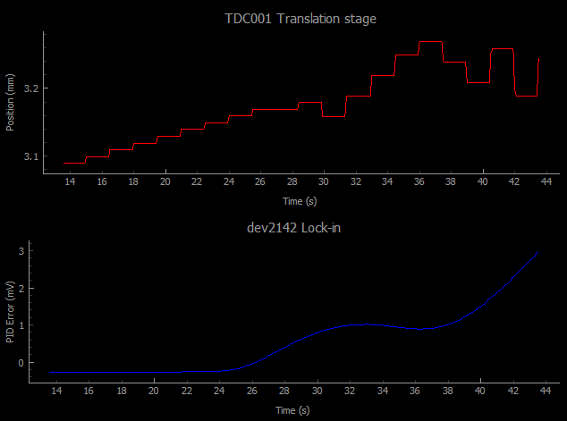

# zi2tl_python

This repository contains python code I've written to read out signals from a Zurich UHFLI Lock-in amplifier and to controll the operation of a Thorlabs TCube controlled translation stage ``` MTS50-Z8 ```. The Lock-in is used for filtering the laser signal from the Thorlabs photodiode directly (i.e. without the need for nanonis or other controllers) from environmental noise sources and to feed that signal into a PID controller. The controller output is then used for appropriately moving the Thorlabs stage back and forth to remain at a particular photodiode voltage signal, as a voltage setpoint in Zurich instrument's LabOne Interface. A live plot updates the user about the current Thorlabs position as well as the error signal from the PID loop.


